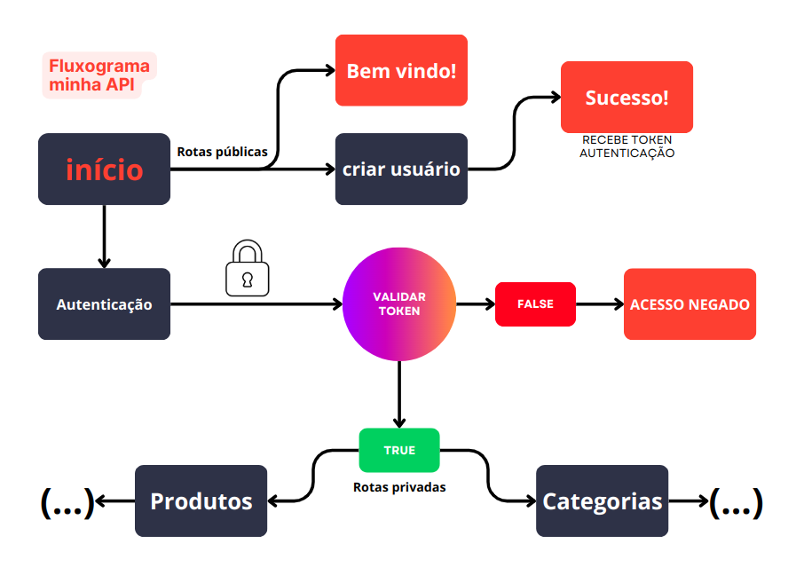

# Challange Opa!

<div style="display: flex;">


</div>

## Propósito do Projeto

Este projeto foi desenvolvido como parte de um desafio técnico para ingressar como desenvolvedor na equipe do Opa! Ele consiste em uma API para gerenciamento de categorias, produtos e autenticação de usuários, utilizando autenticação via token para segurança.

---

## Tecnologias Utilizadas

- **Node.js**: versão 20.18.0  
- **MongoDB**: versão 8.0.3  

---

## Funcionalidades Principais

1. Criação e autenticação de usuários.
2. Gerenciamento completo de produtos e categorias (criação, edição, listagem).
3. Busca de produtos por categoria.
4. Listagem de categorias com seus respectivos produtos.

---

## Instalação e Configuração

### Pré-requisitos
1. **Node.js**: [Baixe aqui](https://nodejs.org/en)
2. **MongoDB**: [Baixe aqui](https://www.mongodb.com/pt-br)

### Clonando o Repositório

Clone o repositório:

```bash
git clone https://github.com/WillianHora/challange_dev_opa.git
```

### Instalando Dependências

Acesse a pasta do projeto e instale as dependências:

```bash
npm install
```

### Configuração do Arquivo `.env`

Crie um arquivo `.env` na raiz do projeto com a  variável "SECRET" para gerar os tokens, exemplo:

```env
SECRET=848fdyIU9R89UD**@!@$$Ho0HDJHAVdifjkkjlfopa0481y30
```

### Configuração do Banco de Dados

#### Banco Local
Se estiver utilizando o MongoDB localmente, certifique-se de que ele esteja rodando e utilize a conexão padrão no arquivo `db_connection.js`:

```javascript
mongoose.connect('mongodb://127.0.0.1:27017/opa-dev');
```

#### MongoDB Atlas
Caso prefira usar o Atlas, ajuste a URL no mesmo arquivo. Recomenda-se armazenar a URL e a senha em variáveis de ambiente e usar a biblioteca `dotenv` para carregá-las.

---

## Executando a Aplicação

Para iniciar o servidor:

```bash
npm start
```

---

## Endpoints da API

Aqui estão as rotas detalhadas da API para facilitar a integração:

### **Autenticação de Usuários**

- **Criar Usuário**  
  **POST** `/user`  
  **Payload**:  
  ```json
  {
    "username": "string",
    "password": "string"
  }
  ```

- **Autenticar Usuário**  
  **POST** `/login`  
  **Payload**:  
  ```json
  {
    "username": "string",
    "password": "string"
  }
  ```

---

### **Gerenciamento de Produtos**

- **Criar Produto**  
  **POST** `/products`  
  **Payload**:  
  ```json
  {
    "name": "string",
    "description": "string",
    "price": "number",
    "amount": "string",
    "categories": "object"
  }
  ```

- **Editar Produto**  
  **PUT** `/products/{id}`  
  **Payload**:  
  ```json
  {
    "name": "string",
    "description": "string",
    "price": "number",
    "amount": "string",
    "categories": "object"
  }
  ```

- **Listar Todos os Produtos**  
  **GET** `/products/all`

- **Obter Produto por ID**  
  **GET** `/products/one/{id}`

- **Listar Produtos de uma Categoria**  
  **GET** `products/catpro/{id}`
---

### **Gerenciamento de Categorias**

- **Criar Categoria**  
  **POST** `/categories`  
  **Payload**:  
  ```json
  {
    "name": "string",
    "description": "string"
  }
  ```

- **Editar Categoria**  
  **PUT** `/categories/{id}`  
  **Payload**:  
  ```json
  {
    "name": "string",
    "description": "string"
  }
  ```

- **Listar Todas as Categorias**  
  **GET** `/categories/all`

- **Obter Categoria por ID**  
  **GET** `/categories/one/{id}`

- **Listar todas as categorias com os produtos que foram vinculados**  
  **GET** `/categories/allWpro`


---

<h2>Fluxograma da aplicação</h2>


